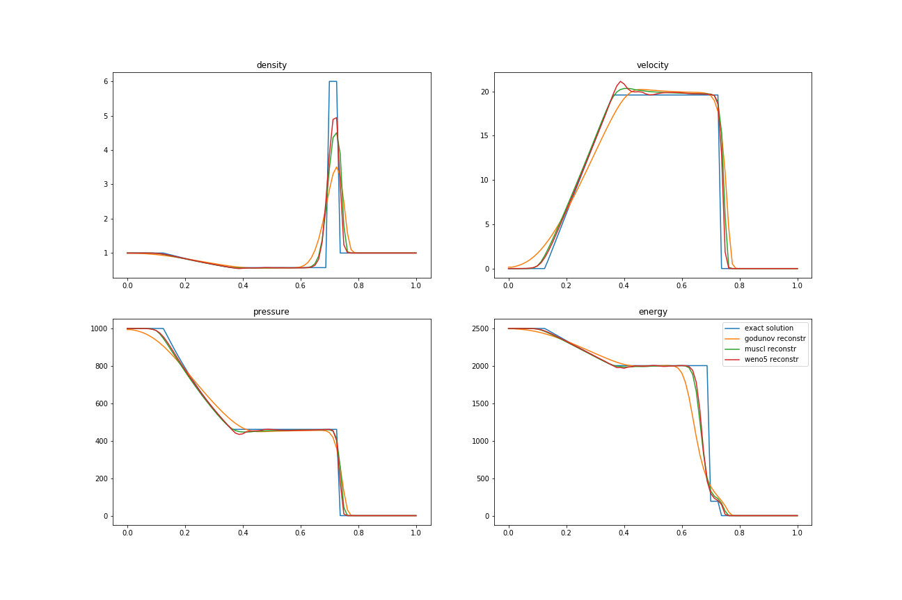
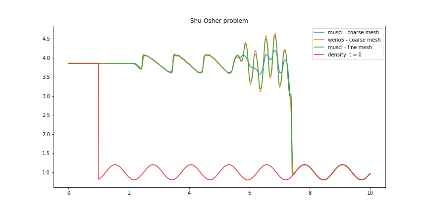

Copyright (C) 2018  Nguyen Ngoc Sang, <https://github.com/SangVn> 

Thư viện **vncfd_1D**, ngôn ngữ Python, hỗ trợ tính toán động lực học một chiều dòng chảy không nhớt, cụ thể là giải hệ phương trình Euler 1D. Thư viện sử dụng ba sơ đồ: Godunov + Runge-Kutta 1 (Euler), MUSCL + Runge-Kutta 2, WENO5 + Runge-Kutta 3.

# Thư viện vncfd_1D gồm có 5 module:

*	constants: chứa các hằng số ví dụ như số mũ đoạn nhiệt 𝛾=1.4
*	convert_variable: chứa các hàm chuyển đổi các kiểu biến ví dụ như từ biến gốc 𝑃(𝜌,𝑢,𝑝) sang biến bảo toàn 𝑈(𝜌,𝜌𝑢,𝜌𝑒)
*	decay: giải quyết bài toán phân rã gián đoạn
*	muscl: sơ đồ muscl và godunov
*	weno5: sơ đồ weno5
*	runge-kutta: phương pháp runge-kutta

Để sử dụng thư viện, hãy đọc **[hướng dẫn sử dụng](https://nbviewer.jupyter.org/github/SangVn/vncfd_1D/blob/master/huong_dan_su_dung.ipynb)**

